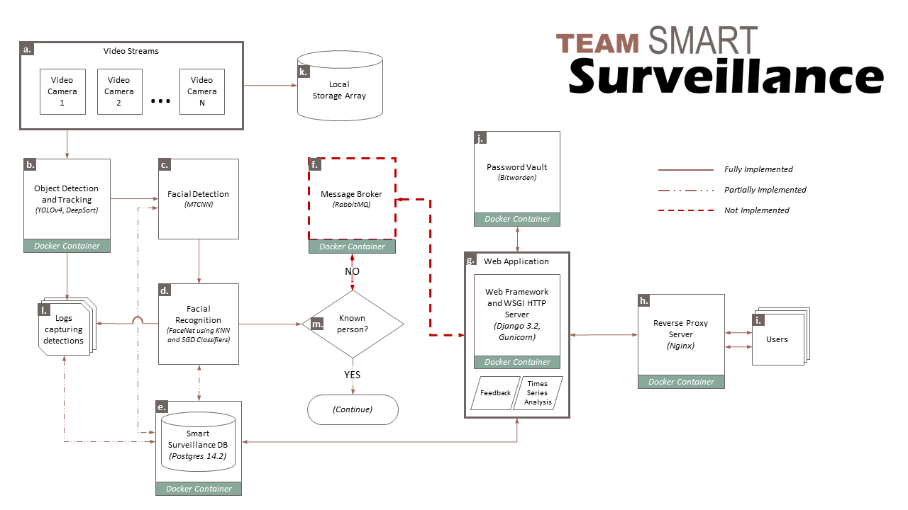

# Welcome to our capstone project "smart survaillance"
Welcome to our capstone project "smart survaillance" for our Master of Applied Data Science from the University of Michigan School of Information.

The authors Akshar and Sandro formed a team to reduce annoying alerts of our current survaillance system by applying computer vison to identify if a tracked person on the video stream is unkown.

A detailed report blog can be viewed at: [https://capstone.analyticsoverflow.com/report](https://capstone.analyticsoverflow.com/report)

## Data Challenge
One of the biggest challenges that we faced early in our project was that there was no dataset "in the wild" that we could use for implementing our project since we wanted to personalize our system to actual users' environments which meant that we would need to know the personalization features to apply. Therefore, all of the data that we would need for training, testing, and evaluation would have to come from our own devices and sources. Here, our team member, Sandro Bruno generously offered his own home and camera setup to be the source of our dataset and fulfill our data requirements.

The streaming video feeds use a set of off-the-shelf IP cameras (Reolink RLC-423) and are run 24x7. There are actually a set of 6 cameras capturing video streams but our project will focus on a single stream from the camera labeled Eingang (translated to entrance). The stream is stored in a local storage array that has the capacity to store a few weeks worth of data. 

## Compilation Challenge
As one can see on our building blocks of our current system below - it is a more complex and interdependent system which we accomplished on our local machines. 

However, it was too hard for us in that short time to make sure tha all components work in other enviroments. Therefore, we have decided to keep that out of scope for this repository. However, in scope of this repository is to demonstrate smaller parts of our system. This together with our detailed report and our [analysis tool](https://capstone.analyticsoverflow.com/analysis) should help you to understand what we have archived. In near future we would like to expand this or another repository to also include the missing building blocks here such that you can also run our system in your enviroment with litle changes.

## Demonstrations
The notebooks mentioned below should demonstrate the following parts
### 1) overcome a cold start of our system [01_Overcome_cold_start_face_recognition.ipynb](01_Overcome_cold_start_face_recognition.ipynb)
#### quick start
configure the paths for the different files on your machine in the configuration file [conf.json](conf.json)  
*NOTE: the weights and architecture of FaceNet are stored in [keras-facenet-h5](keras-facenet-h5)*

To detect, extract and cluster all the detected faces of your personal picture collection you need to run the script below in the terminal. This will output folders of faces that were clustered together and seem to be the identical person. In addition it will store all the extracted encodings, as well as paths to the cropped faces and original pictures in a json file.

```terminal
python main.py -c conf.json -e True -cl True
```
Next you need to manually evaluate the correctnes of the clusters and label the folders with the appropiate name of the subjects. Once this was done you can run the code below to restructure the created database. This database can be used now to reidentify these people.

```terminal
python main.py -c conf.json -r True
```
### 2) comparison of incoming alerts between the IP camera and YOLO/DeepSORT [02_evaluation_of_alerting_system.ipynb](02_evaluation_of_alerting_system.ipynb)

### 3) how to detect faces 

### 4) how to upsample low resolution images

### 5) how we have decided in or out of interest area?

### 4) evaluation of our models [03_model_evaluation.ipynb](03_model_evaluation.ipynb)   
*NOTE: the extensive manually labeled ground truth dataset is stored in [groundTruth](groundTruth) and the precomputed evaluation is stored in [FaceRecognition_evaluation.json](FaceRecognition_evaluation.json)*

