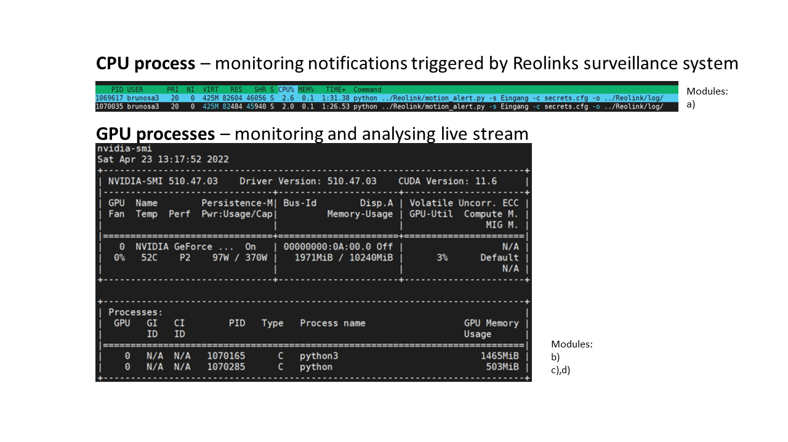

# Welcome to our capstone project "smart survaillance"
Welcome to our capstone project "smart survaillance" for our Master of Applied Data Science from the University of Michigan School of Information.

The authors Akshar and Sandro formed a team to reduce annoying alerts of our current survaillance system by applying computer vison to identify if a tracked person on the video stream is unkown.

A detailed report blog can be viewed at: [https://capstone.analyticsoverflow.com/report](https://capstone.analyticsoverflow.com/report)

## Data Challenge
One of the biggest challenges that we faced early in our project was that there was no dataset "in the wild" that we could use for implementing our project since we wanted to personalize our system to actual users' environments which meant that we would need to know the personalization features to apply. Therefore, all of the data that we would need for training, testing, and evaluation would have to come from our own devices and sources. Here, our team member, Sandro Bruno generously offered his own home and camera setup to be the source of our dataset and fulfill our data requirements.

The streaming video feeds use a set of off-the-shelf IP cameras (Reolink RLC-423) and are run 24x7. There are actually a set of 6 cameras capturing video streams but our project will focus on a single stream from the camera labeled Eingang (translated to entrance). The stream is stored in a local storage array that has the capacity to store a few weeks worth of data. 

## Compilation Challenge
As one can see on our building blocks of our current system below - it is a more complex and interdependent system which we accomplished on our local machines. 

However, it is difficult for us to make sure that all components of this system is reproducible without any error on another system in that short time. Therefore, we appologize for any inconvinience you may experience during the compilation of our system. We tried our best to document the different steps to compile the system. However, we still hope we can provide you a better understanding about what we have archived with this repository together with our detailed [report](https://capstone.analyticsoverflow.com/report)  and our [analysis tool](https://capstone.analyticsoverflow.com/analysis). In future we will defnetly continue working on this repository and are happy about any feedback. 

## Getting started

### This part is needed for the modules a), c) & d)   
you just need to recreate our conda enviroment 
```python
# recreate our conda enviroment 
conda env create -f smart_surveillance.yml
# activate our conda enviroment
conda activate smart_surveillance
```

### This part is needed for module a) in order to use the system with your own camera streams
Any Reolink camera that has a web UI should be compartible with our system eg.: 
+ RLC-423 (validated on our own cameras)
+ RLC-411WS
+ RLC-420-5MP
+ RLC-410-5MP
+ RLC-520
+ C1-Pro
+ D400

you just need to create a *secrets.cfg* file in the *smart_surveillance* folder that contains the credentials for each Reolink camera you want to access
```
# sudo nano smart_surveillance/secrets.cfg
[camera1]
ip=xxx.xxx.xxx.xxx
username=mustermann
password=12345
[camera2]
ip=xxx.xxx.xxx.xxx
username=mustermann
password=12345
[camera3]
ip=xxx.xxx.xxx.xxx
username=mustermann
password=12345
[camera4]
ip=xxx.xxx.xxx.xxx
username=mustermann
password=12345
[camera5]
ip=xxx.xxx.xxx.xxx
username=mustermann
password=12345
```

Now you should be able to access your Reolink camera. The script below will provide you the concrete coordinates of the interest areas you have setted via the official Reolink app and will log any incoming alert that was triggered by the camera. This we have used in our project to compare our system against the alerts coming directly from the camera ([02_evaluation_of_alerting_system.ipynb](02_evaluation_of_alerting_system.ipynb)). Remember we want to reduce the annoying false positive alerts of the alerting system built in the Reolink camera. Therefore, we need the alerts coming from the camera directly as reference.
```terminal
# $source need to be replaced by the camera name setted in the secrets.cfg file e.g. camera1 
python Reolink/motion_alert.py -s $source -c smart_surveillance/secrets.cfg -o Reolink/log/ &
```
In the [*Reolink/log/*](Reolink/log/) folder you can review the output of these monitored events coming from the camera.

### This part is needed for module b)
Here we need to compile the multi object tracker we have customized from [FastMOT](https://github.com/GeekAlexis/FastMOT)
#### Install for x86 Ubuntu
Make sure to have [nvidia-docker](https://docs.nvidia.com/datacenter/cloud-native/container-toolkit/install-guide.html#docker) installed. The image requires NVIDIA Driver version >= 450 for Ubuntu 18.04 and >= 465.19.01 for Ubuntu 20.04. We have built and test it stabely with Driver version 510.47.03 and CUDA Version 11.6 on Ubuntu 20.04:
```terminal
# change directory
cd smart_surveillance/
# build docker
docker build --build-arg TRT_IMAGE_VERSION=21.05 -t  fastmot:latest .
# for displaying within docker
xhost local:root
```
Now we can check if the driver was installed correctly 
```terminal
# check driver 
sudo docker run --gpus all nvidia/cuda:11.0-base nvidia-smi
```

Now we can compile the docker by going in the *plugin* folder and compile it using make
```
cd fastmod/plugins
make
```
then you need to go in the *scripts/* folder and run *download_models.sh* to fetch all the model files
```terminal
cd scripts/
./download_models.sh
```

Now we should be able to launch the docker in an interactive mode - Lets test it via
```docker
# run/open docker
docker run --gpus all --rm -it -v $(pwd):/usr/src/app/FastMOT -v /tmp/.X11-unix:/tmp/.X11-unix -e DISPLAY=unix$DISPLAY -e TZ=$(cat /etc/timezone) fastmot:latest
```

#### Optional
check if you have cv2 available within the launched interactive docker if not you need to install cv2 via wheel within the docker to get all dependencies otherwise it will not work becuase GSTREAMER support for videocapture is not given otherwise
``` docker
pip install --no-binary opencv-python opencv-python
```
try if you can run the tracker on a test video just copy paste any video of your choice (with some people walking around) into the docker folder
```docker
python3 app.py --input-uri fastmod/REC_84194.mov --mot -o test.mp4
```
in case you had to manually install a dependency within the docker e.g. cv2 rember the id of the container indicated in the prompt *root@containerID* and leave the interactive docker via the command *exit*  

In order to display a list of launched containers including yours you need to execute
```terminal
sudo docker ps -a
```
Finally, create a new image by committing the changes using the following syntax
``` terminal
# sudo docker commit [CONTAINER_ID] [new_image_name]
sudo docker commit fa9f6b05cde3 smart_surveillance
# now you should see the saved container in docker images
docker images
```
Now we can launch the saved container
```
docker run --gpus all --rm -it -v $(pwd):/usr/src/app/FastMOT -v /tmp/.X11-unix:/tmp/.X11-unix -e DISPLAY=unix$DISPLAY -e TZ=$(cat /etc/timezone) smart_surveillance:latest
# or
docker run --gpus all --rm -it -v $(pwd):/usr/src/app/FastMOT -v /tmp/.X11-unix:/tmp/.X11-unix -e DISPLAY=unix$DISPLAY -e TZ=$(cat /etc/timezone) containerID_seen_in_docker_image
```

### Overcome a cold start of our system
Once you have managed to compile all the dependencies above - we can now start to personalize the system by letting the system know who your friends and family are.
#### quick start
configure the paths for the different files on your machine in the configuration file [conf.json](conf.json)  
*NOTE: the weights and architecture of FaceNet are stored in [*smart_surveillance/FaceRecognition/ model.json, model.h5*](smart_surveillance/FaceRecognition/)*

To detect, extract and cluster all the detected faces of your personal picture collection you need to run the script below in the terminal. This will output folders of faces that were clustered together and seem to be the identical person. In addition it will store all the extracted encodings, as well as paths to the cropped faces and original pictures in a json file.

```terminal
python main.py -c conf.json -e True -cl True
```
Next you need to manually evaluate the correctnes of the clusters and label the folders with the appropiate name of the subjects. Once this was done you can run the code below to restructure the created database. This database can be used now to reidentify these people.

```terminal
python main.py -c conf.json -r True
```

For a better intuition how it works we have created a brief demo [01_Overcome_cold_start_face_recognition.ipynb](01_Overcome_cold_start_face_recognition.ipynb) that walk you through our scripts. All of that is intended to be executed just once before the system goes in production. After the system is in production our goal is to update the database with images coming direcly from the camera after the homeowner has provided feedback about the specific person (who is it?, do you want to get notified if this person got detected?). This should be a straight forward feature expansion of our system which we are planing to implement in the near future.


## Ready to launch the system
We have created a shell script (*[smart_surveillance/run_scripts.sh](smart_surveillance/run_scripts.sh)*) for our convinience that is launching the different pices of the system as the following:  

```terminal
# direct into the script directory
cd smart_surveillance
# run the shell script with appropiate arguments
./run_scripts.sh -source1 Eingang
```
The script takes the following arguments:
+ -source1-3: used to activate the system on the stated cameras set in secrets.cfg; multiple cameras can be monitored (we have tested it for up to 3 cameras at the same time) 
+ -config: the configuration path to secrets.cfg containing the credentials and IP address of the camera sources (default: smart_surveillance/secrets.json)
+ -output: is the output path in which you would like to log the system (default: ../Reolink/log)
+ -clf: is the path to the personalized pretrained model to recognize a face (default: FaceRecognition/KNN_weighted.json)

in this example we have activated the system just on one camera source called Eingang with the default settings

*NOTE: For now this shell script is focused on our local system. But can be easily customized by just replacing the camera source names in the shell script with the names defined in the [smart_surveillance/secrets.cfg](smart_surveillance/secrets.cfg) file*

if everything works out - you should find 2 processes run on your GPU. One process for module a) & b) and the other process is for module c) & d). Other then this you will aslo find a bunch of CPU proccess for each of the modules a),b),c) & d) as well as the monitoring of the reference alerting system. 


### Output locations:
```
project
│
└───smart_surveillance
│   │
│   └───log
│   │   YOLO4_DeepSORT_source_overview.log
│   │   FaceNet_Eingang_overview.log
│   │   Reolink_motion_alerts_source.log
│   │   ...
│   │
│   └───output*
│   │   camera_source.mp4
│   │   ...
│   │
│   └───FaceRecognition
│       │   
│       └─── FaceNet_input* (contain pictures of tracked person)
│       │    │
│       │    └── camera_source (e.g.: Eingang)
│       │        │ 
│       │        └── in_of_interest_area
│       │        │   └── trackID_1
│       │        │   │   [YEAR][MONTH][DAY]_[h]_[min]_[sec]_[source_camera][frame_nr]_crop_track_[trackID_?].png
│       │        │   │   ...  
│       │        │   └── trackID_2
│       │        │   │   [YEAR][MONTH][DAY]_[h]_[min]_[sec]_[source_camera][frame_nr]_crop_track_[trackID_?].png
│       │        │   │   ...     
│       │        │   └── trackID_n
│       │        │        ...
│       │        │
│       │        └── out_of_interest_area
│       │            └── trackID_1
│       │            │   [YEAR][MONTH][DAY]_[h]_[min]_[sec]_[source_camera][frame_nr]_crop_track_[trackID_?].png
│       │            │   ...  
│       │            └── trackID_2
│       │            │   [YEAR][MONTH][DAY]_[h]_[min]_[sec]_[source_camera][frame_nr]_crop_track_[trackID_?].png
│       │            │   ...     
│       │            └── trackID_n
│       │                ...
│       │
│       └─── FaceNet_output* (contain pictures of detected faces within interest area)
│       │    │ 
│       │    └── camera_source (e.g.: Eingang)
│       │        │ 
│       │        └── in_of_interest_area
│       │            └── trackID_1
│       │            │   [YEAR][MONTH][DAY]_[h]_[min]_[sec]_[source_camera][frame_nr]_crop_track_[trackID_?].png
│       │            │   ...  
│       │            └── trackID_2
│       │            │   [YEAR][MONTH][DAY]_[h]_[min]_[sec]_[source_camera][frame_nr]_crop_track_[trackID_?].png
│       │            │   ...     
│       │            └── trackID_n
│       │                 ...
│       │
│       └─── on_queue (contain pictures of detected faces within interest area)
│       │    │ 
│       │    └── classifier (e.g.: KNN or SGD)
│       │    │   │ 
│       │    │   └── trackID_1
│       │    │   │   └── [YEAR]-[MONTH]-[DAY]
│       │    │   │   │   │        
│       │    │   │   └──[hour]
│       │    │   │   │   │  [YEAR]_[MONTH]_[DAY]_[h]_[min]_[sec]_[trackID_?].log    
│       │    │   │   │   │   ...
│       │    │   │   │   └──...
│       │    │   │   └── ...
│       │    │   └── ...
│       │    └── ...
│       └── ...
│
└───Reolink
│   │
│   └───log
│       Reolink_motion_alerts_source.log 
└── ...     
``` 
Due to privacy issues we cannot share the pictures we have taken over the last 2 weeks of the people walking through our video streams. Thereby, we have marked every parent folder with a \* which could not be included in the repository (same is true for child folders).

#### Brief description of the output
1) [smart_surveillance/log/](smart_surveillance/log/)  
    this directory consits of 3 different log file types:
    + [YOLO4_DeepSORT_source_overview.log](smart_surveillance/log/YOLO4_DeepSORT_Eingang_overview.log)
      + Backbone file which captures all the information ...
        + if a person was detected, lost, reidentified or out of frame
        + a path to a picture that was taken for that tracked person when it is within the interest area   
    + [FaceNet_source_overview.log](smart_surveillance/log/FaceNet_Eingang_overview.log)
      + this log file contains information about the identification of the tracked person ...
        + was a face detected?
        + do we know the person?
        + what is the encoding?
        + what is the closed distance to a known person?  
        + where do we store pictures of the detected faces?   
    + [Reolink_motion_alerts_source.log](smart_surveillance/log/Reolink_motion_alerts_Eingang.log)
      + In order to configure the system appropiatly the file provides the required camera settings such as 
        + source camera
        + resolution 
        + frames per second (FPS) 
        + alerting area (area of interest)
        + bit rate  
*NOTE this is a subset of the [Reolink/log/](Reolink/log/Reolink_motion_alerts_Eingang.log) and had to be copied over because the container is not sharing the same file system - something that has to be changed in the future*  
3) [Reolink/log/](Reolink/log/)
    this directory has the full log of incoming notifications of the camera
    + [Reolink_motion_alerts_source.log](Reolink/log/Reolink_motion_alerts_Eingang.log)
      + whenever a motion was detected the camera triggers an alarm which we encode as a 1 otherwise there is no entry in the log file to not explode the file
5) *smart_surveillance/FaceRecognition*
    + this directory consits of 3 output directories:
        + *FaceNet_input*  
        this directory contains all the images taken by the system from the detected person which is then used by MTCNN 
        + *FaceNet_output*  
        this directory contains all the detected faces which is then used by FaceNet to extract the features for the FaceRecognition 
        + *on_queue*
        this directory was meant to push the whole identification history of a tracked person that was identified as unknown to the messegeBroker module f). We did not manage in the short time to implement the messaging but the building blocks are already implemented and need to be connected only. For now the on_queue folder is created using a (from the system) still decoupled script called [test_SGDC_knn.py](smart_surveillance/test_SGDC_knn.py). This script is running KNN and SGD on existing log files to recognize the detected people and pushs these collected log files for one individual whenever it was identified as unknown. We need to do minor changes to this script to push these alerts in real time coupled with the system.      
6) *smart_surveillance/output*
    + this contains a recorded video with the detected bounding boxes around the tracked people of the analyzed video streams.


## Demonstrations
The notebooks mentioned below should demonstrate the following parts
### 1) overcome a cold start of our system [01_Overcome_cold_start_face_recognition.ipynb](01_Overcome_cold_start_face_recognition.ipynb)
#### quick start
configure the paths for the different files on your machine in the configuration file [conf.json](conf.json)  
*NOTE: the weights and architecture of FaceNet are stored in [*smart_surveillance/FaceRecognition/ model.json, model.h5*](smart_surveillance/FaceRecognition/)*

To detect, extract and cluster all the detected faces of your personal picture collection you need to run the script below in the terminal. This will output folders of faces that were clustered together and seem to be the identical person. In addition it will store all the extracted encodings, as well as paths to the cropped faces and original pictures in a json file.

```terminal
python main.py -c conf.json -e True -cl True
```
Next you need to manually evaluate the correctnes of the clusters and label the folders with the appropiate name of the subjects. Once this was done you can run the code below to restructure the created database. This database can be used now to reidentify these people.

```terminal
python main.py -c conf.json -r True
```
### 2) comparison of incoming alerts between the IP camera and YOLO/DeepSORT [02_evaluation_of_alerting_system.ipynb](02_evaluation_of_alerting_system.ipynb)

### 3) how to detect faces 

### 4) how to upsample low resolution images

### 5) how we have decided in or out of interest area?

### 4) evaluation of our models [03_model_evaluation.ipynb](03_model_evaluation.ipynb)   
*NOTE: the extensive manually labeled ground truth dataset is stored in [groundTruth](groundTruth) and the precomputed evaluation is stored in [FaceRecognition_evaluation.json](FaceRecognition_evaluation.json)*

